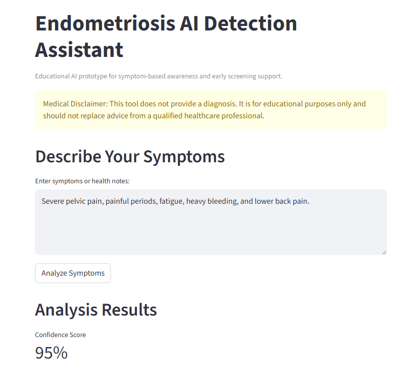
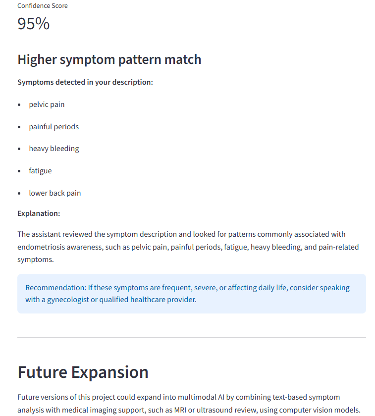

# Endometriosis AI Detection Assistant

## Project Overview
The **Endometriosis AI Detection Assistant** is a healthcare-focused AI application designed to support early awareness of potential endometriosis symptoms.

Users enter symptom descriptions, and the system analyzes the input using Natural Language Processing (NLP) techniques to generate structured, explainable insights.  

⚠️ This tool is **not a diagnostic system**. It is designed for **educational and awareness purposes only** and encourages users to consult healthcare professionals.

---

## The Vision
Endometriosis is often underdiagnosed and can take years to identify.  

This project aims to:
- Help users better understand symptom patterns
- Provide structured, explainable AI insights
- Encourage earlier medical consultation
- Demonstrate responsible AI use in healthcare

---

## The Architecture (The Brains 🧠)

The system follows a simple AI pipeline:

1. **User Input**
   - Text-based symptom descriptions → NLP Model
   - (Future) Medical Images → Computer Vision Model

2. **Preprocessing**
   - Text cleaning
   - Tokenization
   - Encoding into embeddings

3. **Model Layer**
   - Machine Learning / NLP model (TensorFlow / future transformer-based model)
   - Pattern recognition for symptom indicators

4. **Output Layer**
   - Confidence score
   - Explanation of findings
   - Recommendation for medical consultation

5. **Frontend**
   - Streamlit interface for interaction

---

## Technologies Used

- Python
- Streamlit
- TensorFlow (baseline model)
- Pandas / NumPy
- (Planned/Future) Hugging Face Transformers
- GitHub for version control

---

## Features

- Accepts natural language symptom input
- Generates structured, explainable output
- Displays confidence levels
- Provides medical guidance recommendations
- Simple and interactive UI using Streamlit

## Future Improvements

- Add medical imaging analysis (MRI/Ultrasound) using computer vision models
- Expand to multimodal AI (text + image fusion)

---

## Privacy & Security

This project follows a **privacy-first design**:

- No permanent storage of user input
- Data processed in temporary session memory
- No personal health information retained
- Optional export features (future enhancement)
- Medical disclaimer included in outputs

---

## How to Run the Project

### 1. Clone the repository
```bash
git clone https://github.com/samirag2010/Endometriosis-AI.git
cd Endometriosis-AI
```

### 2. Install dependencies
```bash
pip install -r requirements.txt
```

### 3. Run the application
```bash
streamlit run app.py
```

---

## Example Output

### Input


### Results


## Presentation

[View Project Presentation](presentation/Endometriosis-AI-Detection-Assistant (final).pdf)


